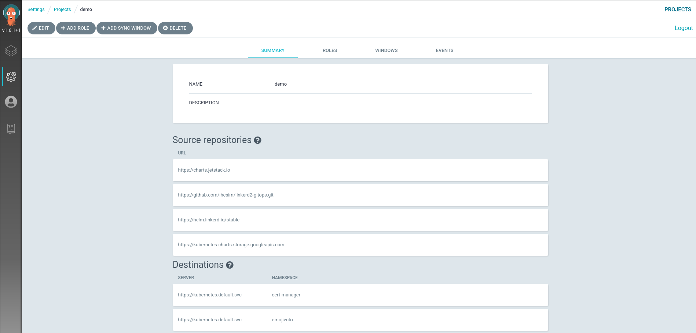

# Linkerd GitOps

This project contains scripts and instructions to manage
[Linkerd](https://linkerd.io) in a GitOps workflow, using
[Argo CD](https://argoproj.github.io/argo-cd/).

The scripts are tested with the following software:

1. [kind](https://kind.sigs.k8s.io/) v0.8.1
1. [Linkerd](https://linkerd.io/) 2.8.1
1. [Argo CD](https://argoproj.github.io/argo-cd/) v1.6.1
1. [cert-manager](https://cert-manager.io) 0.15.0
1. [sealed-secrets](https://github.com/bitnami-labs/sealed-secrets) 0.12.4

## Highlights

* Automate the Linkerd control plane install and upgrade lifecycle using Argo CD
* Incorporate Linkerd auto proxy injection feature into the GitOps workflow to
  auto mesh applications
* Securely store the mTLS trust anchor key/cert with offline encryption and
  runtime auto-decryption using sealed-secrets
* Let cert-manager manage the mTLS issuer key/cert assets
* Utilize Argo CD [projects](https://argoproj.github.io/argo-cd/user-guide/projects/)
  to manage bootstrap dependencies and limit access to servers, namespaces and
  resources
* Uses Argo CD
  [_app of apps_ pattern](https://argoproj.github.io/argo-cd/operator-manual/cluster-bootstrapping/#app-of-apps-pattern)
  to manage application declarative resources

## Getting Started

### Create local K8s cluster

Create a `kind` cluster named `linkerd`:

```sh
kind create cluster --name=linkerd
```

### Set up the local repository

Clone a local copy of the example repository.

```sh
git clone https://github.com/ihcsim/linkerd2-gitops.git
```

Add a new remote endpoint to the *local repository* that points to the
in-cluster Git server that will be created in the next section:

```sh
git remote add git-server git://localhost/linkerd2-gitops.git
```

> Access to the remote Git server will be faciliated over port-forwarding.
> Hence, the new remote endpoint refers to the localhost.

### Set up a Git server

Deploy the Git server to the `scm` namespace:

```sh
cd ./linkerd2-gitopts

kubectl apply -f deploy/git-server
```

This Git server will be used to host repositories that Argo CD will watch.

> This runs the Git server as a [daemon](https://git-scm.com/book/en/v2/Git-on-the-Server-Git-Daemon)
> with unauthenticated access to the Git data, over the `git` protocol.
> This setup is not recommended for production usage.

Confirm that the Git server is healthy:

```sh
kubectl -n scm rollout status deploy/git-server
```

Set up the remote repository:

```sh
git_server=`kubectl -n scm get po -l app=git-server -oname | awk -F/ '{ print $2 }'`

kubectl -n scm exec "${git_server}" -- \
  git clone --bare https://github.com/ihcsim/linkerd2-gitops.git
```

In later steps, changes made to this repository will be sync-ed by Argo CD to
the K8s cluster.

Make sure that push works via port-forwarding:

```sh
kubectl -n scm port-forward "${git_server}" 9418  &

git push git-server main
```

Confirm that the remote repository is cloned successfully:

```sh
kubectl -n scm exec "${git_server}" -- ls -al /git/linkerd2-gitops.git
```

### Deploy Argo CD 1.6.1

Install Argo CD:

```sh
kubectl create ns argocd

kubectl -n argocd apply -f \
  https://raw.githubusercontent.com/argoproj/argo-cd/v1.6.1/manifests/install.yaml
```

Confirm that all the pods are ready:

```sh
for deploy in "application-controller" "dex-server" "redis" "repo-server" "server"; \
  do kubectl -n argocd rollout status deploy/argocd-${deploy}; \
done
```

Use port-forward to access the Argo CD dashboard:

```sh
kubectl -n argocd port-forward svc/argocd-server 8080:443  \
  > /dev/null 2>&1 &
```

The Argo CD dashboard is now accessible at https://localhost:8080/, using the
default `admin` username and
[password](https://argoproj.github.io/argo-cd/getting_started/#4-login-using-the-cli).

> The default admin password is the auto-generated name of the Argo CD API
> server pod. You can use the `argocd account update-password` command to
> change it.

Authenticate the Argo CD CLI:

```sh
argocd_server=`kubectl -n argocd get pods -l app.kubernetes.io/name=argocd-server -o name | cut -d'/' -f 2`

argocd login 127.0.0.1:8080 \
  --username=admin \
  --password="${argocd_server}" \
  --insecure
```

#### Configure project access and permissions

Set up the `demo` project with the list of allowed cluster-scoped RBAC and
remote repositories:

```sh
kubectl apply -f ./project.yaml
```

> The `demo` project is restricted to deploying resources to the same cluster
> that Argo CD is on.
> To register separate remote clusters, use the `argocd cluster add` command.

Confirm that the project is deployed correctly:

```sh
argocd proj get demo
```

On the dashboard:



### Set up parent application

The `main`
[application](https://argoproj.github.io/argo-cd/operator-manual/declarative-setup/#applications)
is the parent application that manages all other applications.

```sh
kubectl apply -f main.yaml
```

Confirm that the `main` application is deployed successfully:

```sh
argocd app get main
```

Sync the `main` application:

```sh
argocd app sync main
```


Note that only the `main` application will be synchronized.

In the following steps, we will synchronize each application individually.

### Deploy cert-manager

Synchronize the cert-manager application:

```sh
argocd app sync cert-manager
```

> We can't use cert-manager 0.16.0 with kubectl <1.19 and Helm 3.2.
> See https://cert-manager.io/docs/installation/upgrading/upgrading-0.15-0.16/#helm

Confirm that cert-manager is running:

```sh
for deploy in "cert-manager" "cert-manager-cainjector" "cert-manager-webhook"; \
  do kubectl -n cert-manager rollout status deploy/${deploy}; \
done
```


### Deploy sealed-secrets

Synchronize the sealed-secrets application:

```sh
argocd app sync sealed-secrets
```

Confirm that sealed-secrets is running:

```sh
kubectl -n kube-system rollout status deploy/sealed-secrets
```


### Prepare the Linkerd mTLS trust anchor

Create the mTLS trust anchor offline:

```sh
step certificate create identity.linkerd.cluster.local ./deploy/linkerd/sample-trust.crt ./deploy/linkerd/sample-trust.key \
  --profile root-ca \
  --no-password \
  --not-after 43800h \
  --insecure
```

Inspect the details (encryption algorithm, expiry date etc.) of the new trust
anchor:

```sh
step certificate inspect ./deploy/linkerd/sample-trust.crt
```

Encrypt the trust-anchor in a `SealedSecret` resource:

```sh
kubectl -n linkerd create secret tls linkerd-trust-anchor \
  --cert ./deploy/linkerd/sample-trust.crt \
  --key ./deploy/linkerd/sample-trust.key \
  --dry-run=client -oyaml | \
kubeseal --controller-name=sealed-secrets -oyaml - | \
kubectl patch -f - \
  -p '{"spec": {"template": {"type":"kubernetes.io/tls", "metadata": {"labels": {"linkerd.io/control-plane-component":"identity", "linkerd.io/control-plane-ns":"linkerd"}, "annotations": {"linkerd.io/created-by":"linkerd/cli stable-2.8.1", "linkerd.io/identity-issuer-expiry":"2021-07-19T20:51:01Z"}}}}}' \
  --dry-run=client \
  --type=merge \
  --local -oyaml > ./deploy/linkerd/trust-anchor.yaml
```

This will overwrite the existing `SealedSecret` resource in your local
`./deploy/linkerd/trust-anchor.yaml`.

Confirm that only the `spec.encryptedData` is changed:

```sh
git diff ./deploy/linkerd/trust-anchor.yaml
```

Commit and push the new trust anchor secret to the Git server:

```sh
git add ./deploy/linkerd/trust-anchor.yaml

git commit -m "update encrypted trust anchor"

git push git-server main
```

Make sure the commit is pushed to the Git server:

```sh
kubectl -n scm exec "${git-server}" -- git --git-dir linkerd2-gitops.git log -1
```

### Bootstrap the mTLS resources

Synchronize the `linkerd-bootstrap` application:

```sh
argocd app sync linkerd-bootstrap
```

> If the issuer and certificate resources appear in a degraded state, it's
> likely that the sealed-secrets controller failed to decrypt the sealed trust
> anchor. Check the sealed-secrets controller for error logs.

Confirm that all the mTLS secrets are created:

```sh
kubectl -n linkerd get secret,issuer,certificates
```


### Deploy Linkerd

Retrieve the trust anchor from the live secret resource:

```sh
trust_anchor=`kubectl -n linkerd get secret linkerd-trust-anchor -ojsonpath="{.data['tls\.crt']}" | base64 -d -w 0 -`
```

Confirm that it matches the new trust anchor we created previously:

```sh
echo "${trust_anchor}" | step certificate inspect -
```

The next step involves passing the new trust anchor into the `linkerd`
application as a Helm parameter:

Before the first synchronization, the `global.identityTrustAnchorsPEM` parameter will appear to be empty:

```sh
argocd app get linkerd -ojson | \
  jq -r '.spec.source.helm.parameters[] | select(.name == "global.identityTrustAnchorsPEM") | .value'
```


Override the `global.identityTrustAnchorsPEM` parameter in the `linkerd`
application with the value of `${trust_anchor}`.

```sh
argocd app set linkerd --helm-set global.identityTrustAnchorsPEM=${trust_anchor}
```

Confirm that the new trust anchor is uploaded to Argo CD:

```sh
argocd app get linkerd -ojson | \
  jq -r '.spec.source.helm.parameters[] | select(.name == "global.identityTrustAnchorsPEM") | .value'
```


Synchronize the `linkerd` application:

```sh
argocd app sync linkerd
```

Check that Linkerd is ready:

```sh
linkerd check
```


At this point, the `main` application will go out-of-sync due to a mismatch in
the live trust anchor and that defined in the YAML manifest in the
`./apps/linkerd.yaml` file.

The next step will involve manually updating the YAML manifest and push it to
the Git server.

Use your editor to assign the the value of `${trust_anchor}` to the
`global.identityTrustAnchorsPEM` parameter in the `./apps/linkerd.yaml` file.

Confirm that only the `spec.source.helm.parameters.value` field is changed:

```sh
git diff ./apps/linkerd.yaml
```

Commit and push the changes to the Git server:

```sh
git add ./apps/linkerd.yaml

git commit -m "set global.identityTrustAnchorsPEM parameter"

git push git-server main
```

Re-run `argocd app sync main` to synchronize the `main` application.

### Test with emojivoto

Deploy emojivoto to test auto proxy injection:

```sh
argocd app sync emojivoto
```

Check that the applications are healthy:

```sh
for deploy in "emoji" "vote-bot" "voting" "web" ; \
  do kubectl -n emojivoto rollout status deploy/${deploy}; \
done
```


### Upgrade Linkerd to 2.8.1

Use your editor to change the `spec.source.targetRevision` field to `2.8.1` in
the `./apps/linkerd.yaml` file:

```sh
git diff ./apps/linkerd.yaml
```

Commit and push this change to the Git server:

```sh
git add ./deploy/linkerd.yaml

git commit -m "upgrade Linkerd to 2.8.1"

git push git-server main
```

Synchronize Linkerd:

```sh
argocd app sync linkerd

linkerd check

linkerd check --proxy

linkerd version
```

### Clean up

```sh
argocd app delete main --cascade=true
```
